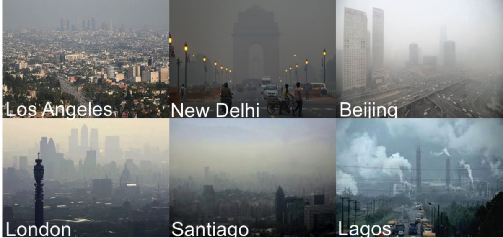
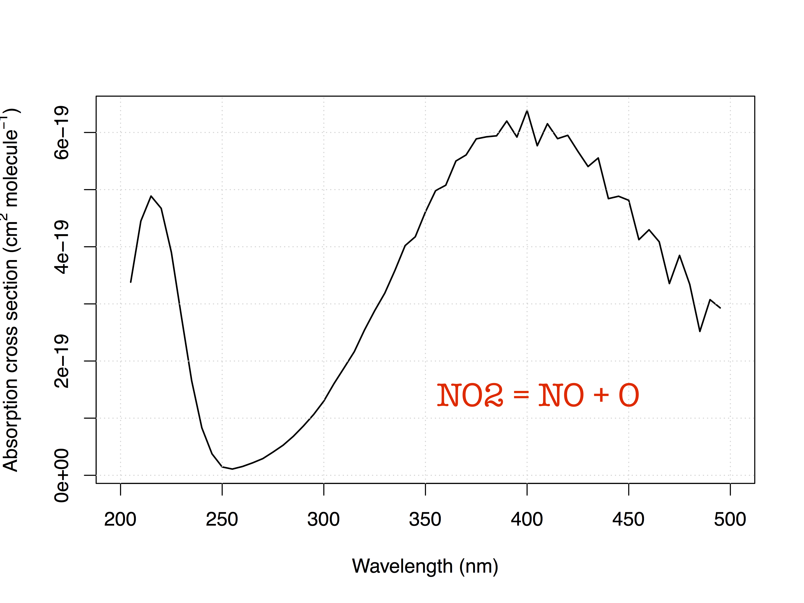
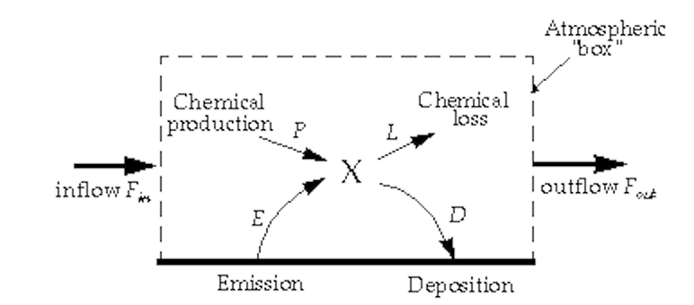
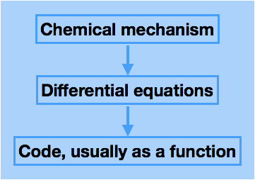
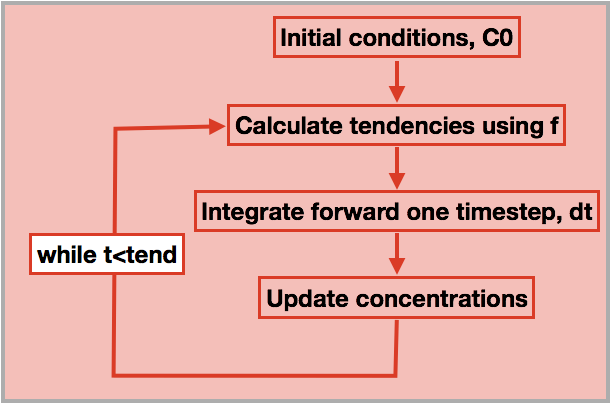

Lecture 1
=========

Goals
-----

- Introduce concepts of atmospheric chemistry

    -   Today it's all about ozone
    -   Primary/secondary pollutants
    -   Emission/deposition
    -   Photochemistry

-  Run first numerical simulation of a chemical system

    -   Simple photochemical system

-  Code is available
    [here](https://www.gitlab.com/ptg21/LCLUC_presentation)

- You can clone the code using [git](https://git-scm.com/) via

    `git clone git@gitlab.com:ptg21/LCLUC_presentation.git`

---

Who is this course for?
-----------------------

- My goal is to introduce atmospheric chemistry with a focus on
    tropospheric ozone and other secondary pollutants.

-  I won't discuss the chemistry in detail but will summarise the
    relevant reactions. It gets complex towards the end.

-  The goal is to use these reactions to study how ozone levels respond
    to other pollutants.

- Our focus is on rates of production of ozone during the day.

- For the purpose of this course, **everything** is a pollutant.

---

Tricks of the trade
-------------------

- Mostly think about processes in terms of their characteristic
    timescales

    -   How fast is ozone formed?
    -   How fast is transport out of the planetary boundary layer?
    -   How does this compare with transport times?

-  What are the important species?

    -   Ozone
    -   NO~2~
    -   Aldehydes
    -   Oxidants such as OH, NO~3~
    -   Key species such as O^1^D


General comments on atmospheric pollution
=========================================

Air pollution is a global problem
---------------------------------



Biogenic emissions are also important
-------------------------------------

![Figure 2: []{#dickie_ridge}'Trees cause more pollution than
automobiles do' - Ronald Reagan,
1981](figures/dickie_ridge.png "dickie_ridge")

Typical levels of atmospheric constituents
------------------------------------------

  Pollutant   Concentration   Lifetime / yr
  ----------- --------------- ---------------
  CH~4~       1700 ppbv       10
  H~2~        500 ppbv        4
  CO          40-200 ppbv     0.2
  O~3~        20-120 ppbv     0.05
  OH          0.1 pptv        0.1s

1 ppbv = 10^-9^
1 pptv = 10^-12^

---

US EPA Air Quality Index levels of pollutants
---------------------------------------------

  Pollutant   Low     Moderate   UFSG       Unhealthy
  ----------- ------- ---------- ---------- -----------
  Ozone       0-54    55-70      71-85      86-105
  NO~2~       0-53    54-100     101-360    186-304
  CO          0-4.4   4.5-9.4    9.5-12.4   12.5-15.4

Levels are in ppbv

---

Primary and secondary pollutants
--------------------------------

**Primary** Emitted directly into the atmosphere (usually at the
surface)

-   Nitric oxide, NO
-   Volatile organic compounds such as methane, CO
    -   Biogenic VOCs suc as isoprene, terpenes, formaldehyde (HCHO)
    -   Anthropogenic VOCs such as benzene, gasoline
-   Primary aerosol such as soot
-   SO\_2

**Secondary** Made in the atmosphere by [5.1](#oxidation)

-   Ozone, O~3~
-   NO~2~
-   Formaldehyde (HCHO)


Quantitative treatment of chemical processes
============================================

Emission and loss - Timescales in atmospheric chemistry
-------------------------------------------------------

Considering the atmosphere as a whole, or some air-mass within in it, we
could write an equation describing the rate of change ('tendency') of a
species.

Prognostic equation for species X, with concentration $x$

\vspace{-0.1in}

\begin{eqnarray*}
\frac{dx}{dt} &=& R -k x
\end{eqnarray*}

where R is the rate of emission of X and k is a constant

We now have a first-order linear differential equation, which can be
solved to give

\vspace{-0.1in}

\begin{eqnarray*}
x(t) &=& \frac{R}{k_1}\big(1-\exp (-k_1 t)\big)
\end{eqnarray*}

System has a characteristic time, $\tau = 1/k$

---


Time dependence of X
--------------------


The rate law
------------

- Basic points

    -   Rate is defined as change in concentration per unit time
    -   Natural unit of concentration in air quality modelling:
        -   concentration: **molecules per cm^3^ gas** so units are
            cm$^{-3}$
        -   rate: cm$^{-3}$ s$^{-1}$
    -   [Law of Mass
        Action](https://en.wikipedia.org/wiki/Law_of_mass_action) -
        Double the concentration = Double the rate

-  NO + O~3~ = NO~2~ + O~2~

    -   The rate of change of NO can be expressed as

\vspace{-0.1in}

\begin{eqnarray*}
\frac{d [NO]}{dt} &=& -k_1[NO][O_3]
\end{eqnarray*}

-   Similarly, $\frac{d[NO_2]}{dt} = k_1[NO][O_3]$


Photochemistry
==============

Photochemistry []{#oxidation}
-----------------------------

-   Molecules absorb photons and the chemical bonds are broken -
    *photolysis*

\vspace{-0.1in}

\begin{eqnarray*}
\mathrm{NO}_2 + hv \rightarrow \mathrm{NO} + \mathrm{O}
\end{eqnarray*}

-   Rate of
    [photolysis](https://en.wikipedia.org/wiki/Photodissociation)
    depends on number of photons of the correct wavelength.

\vspace{-0.1in}

\begin{eqnarray*}
\frac{d[\mathrm{NO}_2]}{dt} &=& - J [\mathrm{NO}_2]
\end{eqnarray*}

J depends on molecule and flux of photons (hence: time of day, lat, lon,
cloud cover). Units of J are s^-1^

---


Example: NO~2~
------------



Example: NO~2~
------------


First example: the NO/NO\_2 interconversion by ozone
====================================================

NO~2~/NO 'Photostationary state'
--------------------------------

Using the reactions already given,

\vspace{-0.1in}

\begin{eqnarray*}
\mathrm{NO} + \mathrm{O}_3  & \rightarrow & \mathrm{NO}_2 + \mathrm{O}_2\\
\mathrm{NO}_2 + hv &\rightarrow& \mathrm{NO} + \mathrm{O}\\
\mathrm{O}_2 + \mathrm{O} &\rightarrow & \mathrm{O}_3\\
\end{eqnarray*}

\vspace{-0.15in}

we can write rates of change for each species

\vspace{-0.1in}

\begin{eqnarray*}
\frac{d[\mathrm{NO}_2]}{dt}  &=& - J_1 [\mathrm{NO}_2] + k_3\mathrm{[NO]}\mathrm{[O}_3]\\
\frac{d[\mathrm{NO]}}{dt}    &=&   J_1 [\mathrm{NO}_2] - k_3\mathrm{[NO]} \mathrm{[O}_3] \\
\frac{d\mathrm{[O]}}{dt}     &=& - k_2 [\mathrm{O}][\mathrm{O}_2] + J_1 [\mathrm{NO}_2] \\
\frac{d\mathrm{[O}_3]}{dt}   &=&   k_2 [\mathrm{O}][\mathrm{O}_2]  - k_3 \mathrm{[NO]} \mathrm{[O}_3]
\end{eqnarray*}

A set of coupled differential equations results!

---


How to proceed - I
------------------

What is our mechanism going to do?

[columns]

[column=0.5]

-   We can see that NO and ozone make NO2
-   NO2 makes NO and O, and O makes O3
-   so NO2 regenerates the NO and O3
-   This is an active equilibrium - NO and NO2 interconvert, consuming/releasing ozone as they do so.

[column=0.5]

{ width=60% }


[/columns]

As we shall see in L2, this equilibrium is crucial.

---


How to proceed - II
-------------------

-   So we expect our equations to solve to an equilibrium with zero net
    rate of change

-   There exists a wealth of literature on the solution of these stiff
    differential equations (lifetimes of each species vary by many
    orders of magnitude, resulting in small timesteps).

-   In our example, the lifetime of O is very short, set by k\_2\[O2\],
    while that of NO2 is determined by J and can be much longer.

-   Step forward our numerical ('box') model...


Box models
==========


Box models
----------

[columns]

[column=0.5]

-   Box models represent a single representative area of the
atmosphere.
-   Notionally 1cm\^3 in volume
-   Can be connected to the ground via emission/deposition.
-   Could also be chosen to represent the free troposphere.
-   Need to supply photolysis rates, emissions


[column=0.5]

{width=150%}
comment: 'image downloaded from here [http://acmg.seas.harvard.edu/people/faculty/djj/book/bookchap3-1.gif']

[/columns]

---


Anatomy of a box model - I
--------------------------
[columns]

[column=0.5]

-   Box models need a chemical mechanism.
-   The literature can supply these, or you can write your own.
-   You then code up the mechanism as a differential for each species, in
    terms of other species' concentrations and other inputs.

[column=0.5]



[/columns]

---

Anatomy of a box model - II
---------------------------

[columns]

[column=0.5]

-   Implementation in the language of your choice
-   You need an integrator for the differential equations.
-   There are good ones already implemented, so don't write your own!
-   Typically you supply initial conditions, C0, functions for the tendency of
    each species,$f$, a timestep (dt) and an end point (tend).

[column=0.5]

{width=80%}

[/columns]


Practical one
=============

End of lecture 1
----------------

- Getting started

    -   Open RStudio or R
    -   Look at \tt kinetics-box-model-pss.R

    in the src folder.

    -   What do equations describe?
    -   What do you expect to happen?

-  **Any Pythonistas in the audience?**

---

Practical one
-------------

- Run the simulation

-   ```source("kinetics-box-model-pss.R")```

-  Do the results make sense?

	-   If so: get a coffee!
	-   If not: shout out!

- Coffee break

---
