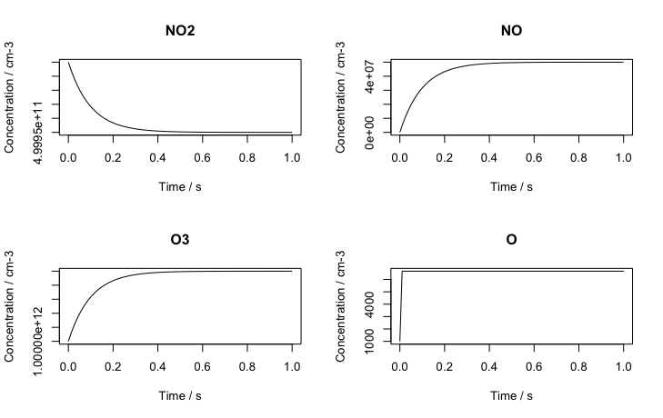
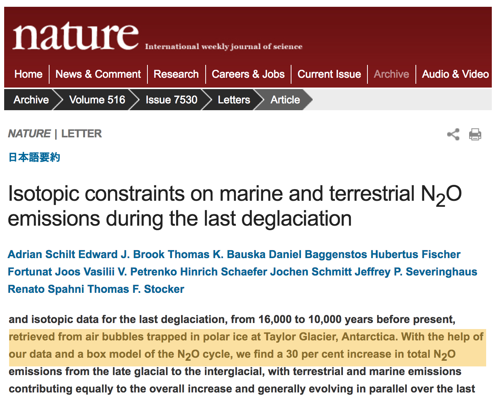

Recap of the first hour
-----------------------

-  Begun to think about putting together a chemical mechanism

-  First model looked at the NO / NO~2~ / O~3~ interconversion
    reactions




---

Box models in recent literature
-------------------------------

-  Box models are great for process-based studies and the box can be as
    big as you like

[columns]

[column=0.5]



[column=0.5]


[/columns]


- Can focus on processes of interest, parameterize other processes (e.g. mixing), build up complexity as required.


Goals of lecture 2
==================


Goals of lecture 2
------------------

-  Introduce ozone formation reactions

    -   Photochemical oxidant, OH, formation
    -   Peroxy radicals introduction

-  Run a box model describing ozone formation

    -   Conceptual overview of a box model
    -   Implementing air quality into a box model

---

Our mechanism
-------------

Our mechanism is rather complex - the CO and NO emissions interact with
sunlight and water vapour

\begin{eqnarray*}
\mathrm{NO}_2 + hv        & \rightarrow & \mathrm{NO} + \mathrm{O} \\
\mathrm{O}_2 + \mathrm{O} & \rightarrow & \mathrm{O}_3 \\
\mathrm{NO} + \mathrm{O}_3 &\rightarrow & \mathrm{NO}_2 + \mathrm{O}_2 \\
\mathrm{O}_3 + hv          & \rightarrow & \mathrm{O}_2 + \mathrm{O1D} \\
\mathrm{O1D} + \mathrm{H}_2\mathrm{O}  & \rightarrow & 2 \mathrm{OH} \\
\mathrm{O1D} + \mathrm{N}_2 / \mathrm{O}_2  & \rightarrow &  \mathrm{O} + \mathrm{N}_2 / \mathrm{O}_2  \\
\mathrm{OH} + \color{red} \mathrm{CO} \color{black} + \mathrm{O}_2 & \rightarrow &  \mathrm{HO}_2 + \mathrm{CO}_2 \\
\color{red} \mathrm{NO} \color{black}  + \mathrm{HO}_2 &\rightarrow & \mathrm{OH} + \mathrm{NO}_2
\end{eqnarray*}

Primary species coloured in red

---

Some general points
-------------------

-  VOCs such as CO are degraded by reaction with OH

    \vspace{-0.15in}

    \begin{eqnarray*}
    \mathrm{OH} + \mathrm{CO} +\mathrm{O}_2 & \rightarrow &  \mathrm{HO}_2 + \mathrm{CO}_2
    \end{eqnarray*}

    and HO~2~ (a class of 'peroxy') radicals are produced.

-  NO2 is produced **additionally** via reaction of peroxy radicals
    with NO

    \vspace{-0.15in}

    \begin{eqnarray*}
    \mathrm{NO} + \mathrm{HO}_2 &\rightarrow & \mathrm{OH} + \mathrm{NO}_2
    \end{eqnarray*}

-  NO2 photolysis leads to O3

    \vspace{-0.15in}

    \begin{eqnarray*}
    \mathrm{NO}_2 + hv & \rightarrow & \mathrm{NO} + \mathrm{O} \\
    \mathrm{O}_2 + \mathrm{O} & \rightarrow & \mathrm{O}_3
     \end{eqnarray*}


---

Implementation in a box model
-----------------------------

As a series of tendencies

``` {.python}

dNO2 = -J1*NO2   + k3*NO*O3 + k8*HO2*NO - k9*OH*NO2 +
      k13*OH*HONO2

dNO  =  J1*NO2   - k3*O3*NO - k8*HO2*NO

dO3  =  k2*O     - k3*NO*O3 - J4*O3

dO   =  J1*NO2   - k2*O  + k5*O1D*M
```
---

```{.python}

dOH  =  2.k6*O1D*H2O - k7*OH*CO + k8*HO2*NO +
      k11*HO2*O3 - k12*OH*O3 - k9*OH*NO2  

dHO2 =  k7*OH*CO - k8*HO2*NO - k11*HO2*O3 +
      k12*OH*O3 - k14*HO2*HO2

dCO  = -k7*OH*CO

dO1D =  J4*O3    - k5*O1D*M     - k6*O1D*H2O

dHONO2 = k9*OH*NO2 - k13*OH*HONO2
```


Formation of OH
===============

Formation of OH from ozone and water vapour
-------------------------------------------

The photochemical oxidant, OH, is formed from ozone and water vapour.

\vspace{-0.15in}

\begin{eqnarray*}
\mathrm{O}_3 + hv & \rightarrow & \mathrm{O}_2 + \mathrm{O1D} \\
\mathrm{O1D} + \mathrm{H}_2\mathrm{O}  & \rightarrow & 2\color{red} \mathrm{OH} \\
\mathrm{O1D} + \mathrm{N}_2 / \mathrm{O}_2  & \rightarrow &  \mathrm{O} + \mathrm{N}_2 / \mathrm{O}_2  
\end{eqnarray*}

-  Via excited state oxygen atoms - the O1D species.

    These are distinct from the ground state oxygen atoms, O, produced
    by NO2 photolysis.

-  The photochemical oxidant OH is reactive towards VOCs. This species
    initiates the photochemical degradation of VOCs and in the presence
    of NO will produce ozone.


Reaction of photochemical oxidant, OH, with VOCs to produce ozone
=================================================================


Reaction of photochemical oxidant, OH, with VOCs
------------------------------------------------

Able to react with CO and with other VOC via the H atoms, and so
initiate photo-degradation.

\vspace{-0.15in}

\begin{eqnarray*}
 \mathrm{OH} + \mathrm{CO} +\mathrm{O}_2 & \rightarrow & \color{red} \mathrm{HO}_2 \color{black} + \mathrm{CO}_2 \\
 \mathrm{OH} + \mathrm{CH}_4  & \rightarrow & \mathrm{H}_2\mathrm{O} + \color{red}  \mathrm{CH}_3\mathrm{O}_2 \\
 \end{eqnarray*}

Once produced, these peroxy radicals oxidize NO to NO2 and ozone is
produced.

\vspace{-0.15in}

\begin{eqnarray*}
\mathrm{NO} + \mathrm{HO}_2 &\rightarrow & \mathrm{OH} + \mathrm{NO}_2 \\
\mathrm{NO}_2 + hv & \rightarrow & \mathrm{NO} + \mathrm{O} \\
\mathrm{O}_2 + \mathrm{O} & \rightarrow & \mathrm{O}_3
\end{eqnarray*}

Without the HO~2~ the NO reacts with ozone to produce NO2, which
recreates the ozone. No net ozone production!!


Conclusions
===========

Conclusions
-----------

-  If you have an air mass with NO, VOC (here CO) and sunlight you can
    expect ozone formation.

-  The amount of ozone formed also depends on H~2~O, number of photons
    (sunlight).

-  You can calculate the rate at which ozone is being formed.

-  Without these ozone will be destroyed

---

Ozone in model world
--------------------


Practical 2
===========

Practical 2
-----------

-   Open RStudio or R
-   Look at \tt kinetics-box-model-ozone.R

in the src folder.

-   What do equations describe?
-   What do you expect to happen?

-  \color{red} Any Pythonistas in the audience?

---

Practical 2
-----------

-  Run the simulation

    -   `source("kinetics-box-model-ozone.R")`

    -   Can you shift the atmosphere from ozone destruction to ozone
        production?
    -   How?


Conclusions/next steps
======================

Next steps
----------

-  Hand coding the tendency functions gets tedious and can be
    error-prone.

    -   Automatic code generation is possible
    -   See [KPP](http://people.cs.vt.edu/asandu/Software/Kpp/), the
        *Kinetic Pre-Processor*
    -   Generates F77, F90, C, Matlab code which you compile and run (or
        run within Matlab)

    -   This has been incorporated into
        [DSMACC](https://github.com/barronh/DSMACC)

    This is an excellent model but its usage requires good Shell and
    compiler skills.

-  It's easy to show that J values are key to the chemistry

    + Consider using a verifiable radiative transfer model such as
    [TUV](https://www2.acom.ucar.edu/modeling/tropospheric-ultraviolet-and-visible-tuv-radiation-model)
    (Tropospheric Ultraviolet and Visible TUV model)


Useful links
============

<http://acmg.seas.harvard.edu/education.html>

particularly

<http://acmg.seas.harvard.edu/education.html#mmac>
--


Emissions and deposition
========================

Emission of primary pollutants
------------------------------

- Emissions into a boundary layer - dimensional analysis

    -   Emissions per unit surface area:
        -   Flux $E$ has units of (molecules) per unit of surface area
            per unit time (cm^-2^ s^-1^)
    -   Into a well-mixed layer of height $h$ (cm)

-  Rate equation

    -   A rate of change of $E/h$

    \vspace{-0.1in}

    \begin{eqnarray*}
    \frac{d[NO]}{dt} &=& E_{NO}/h
    \end{eqnarray*}

    has the correct dimensions (cm^-3^ s^-1^)

---


Dry deposition at the surface
-----------------------------

-   Flux depends on concentration in gas phase above surface and on the
    reactivity of the surface
-   Flux has units of (molecules) per unit of surface area per unit time
    (cm^-2^ s^-1^)

\vspace{-0.1in}

\begin{eqnarray*}
\mathrm{Flux} &\propto& C[O_3]
\end{eqnarray*}

-   Units of C are therefore cm s^-1^, a 'velocity', $v$, dependent on
    surface type

\vspace{-0.1in}

\begin{eqnarray*}
\frac{d[O_3]}{dt} &=& - \frac{v}{h}[O_3] = - k_1 [O_3]
\end{eqnarray*}


